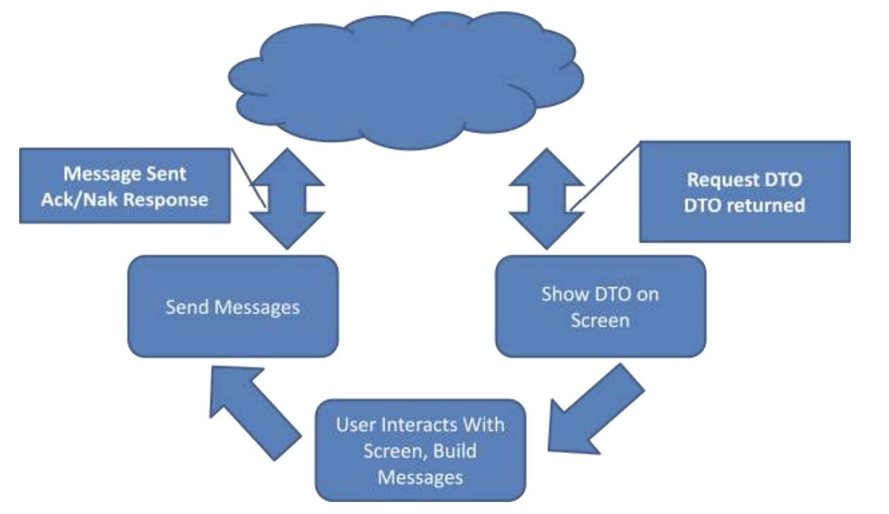

# 任务导向的接口设计（Task Based User Interface）

This chapter introduces the concept of a Task Based User Interface and compares it with a CRUD style user interface. It also shows the changes that occur within the Application Server when a more task oriented style is applied to it’s API.

本章介绍任务导向的接口设计的概念，也会将其与CRUD式的接口设计进行比较。本章还会展示当更多的任务导向的接口设计应用起来时，应用服务层的变化，

One of the largest problems seen in “A Stereotypical Architecture” was that the intent of the user was lost. Because the client interacted by posting data-centric DTOs back and forth with the Application Server, the domain was unable to have any verbs in it. The domain had become a glorified abstraction of the data model. There were no behaviors, the behaviors that existed, existed in the client, on pieces of paper, or in the heads of the users of the software.

“典型的架构”中最大的问题之一是用户的意图会丢失。因为客户端与应用服务器的交互方式是来回传递以数据为中心的DTO，因此这样的情况下领域内不包含任何动词。领域变成了一种数据模型的抽象美化，而没有任何行为。行为只存在于客户端，文档中或者是软件使用者的脑海里。

> 狠狠的讽刺呀。

Many examples of such applications can be cited. Users have “work flow” information documented for them. Go to screen xyz edit foo to bar, then go to this other screen and edit xyz to abc. For many types of systems this type of workflow is fine. These systems are also generally low value in terms of the business. In an area that is sufficiently complex and high enough ROI in order to use Domain Driven Design these types of workflows become unwieldy.

可以举例许多这样的案例。用户们有“工作流”文档。在屏幕上将foo编辑成bar，之后去另一个屏幕上将xyz编辑成abc。许多类型的系统中，这样的（分散的）的工作流已经足够了。这些系统普遍上是商业回报低的系统。而在具有足够复杂性且有足够投资回报率（ROI，Return on Investment）的系统中，即适用领域驱动设计的系统中，这样的工作流设计就会变得难以处理。

> 简单的系统不需要引入DDD，简单的设计足矣，而需要长期演进的复杂系统，适合DDD。

One reason that is commonly cited for wanting to build a system such as described is that “the business logic and work flows can be changed at any time to anything without need of a change to the software”. While this may be true it must be asked at what cost. What happens when someone misses a step in the process they have in their head or you have multiple users who do it differently as is commonly the case? How do you get any reasonable information out of a system in terms of reporting?

人们常提到的想要构建一个如上述所描述的系统的一个原因是：“业务逻辑和工作流程可以在任何时候被改变成任何内容，而无需对软件进行修改”。 尽管这可能是真的，但我们必须问问代价是什么，尤其是当某人忘掉流程中的某一步或者各种用户以各种方式使用软件的时候？你怎么保证系统都会得到合理的输出呢？

\
One way of dealing with this issue is to move away from the DTO up/down architecture that was illustrated in a “Stereotypical Architecture”. Figure 1 shows the client interaction side of a DTO up/down architecture.

一个应对该问题的方式是远离“典型的架构”这样的DTO上传和下载的架构，即Figure 1展示的那样。

> 这里再把图1捞出来：

<figure><figcaption>
Figure 4 Interaction in a DTO Up/Down Architecture
</figcaption></figure>

The basic explanation of the operation is that the UI will request a DTO, say for Customer 1234 from the Application Server. This DTO will be returned to the client and then shown on the screen. The user will interact with the DTO in some way (likely either directly or through a View Model). Eventually the client will click Save or some other trigger will occur and the client will take the DTO and send it back up to the Application Server. The Application Server will then internally map the data back to the domain model and save the changes returning a success or failure.

这样的架构的基本解释是UI需要DTO，比如从应用服务器获取顾客1234，DTO就会被返回给客户端，之后展示在屏幕上。用户和DTO以某种方式进行交互（比如直接或间接的操作视图模型（View Model））。最终客户端会点击保存按钮或者使用其他的触发方式，使得客户端将DTO对象返回给应用服务器。应用服务器随后将数据内部映射回域模型并保存更改，且返回成功或失败的结果。

\
As discussed the intention of the user is being lost because a DTO is being sent up that just represents the current state of the object after the client’s actions are completed. It is possible to bring forward the intention of the user; this will allow the Application Server to process behaviors as opposed to saving data. Figure shows an interaction capturing intent.

2025年04月26日20:35:23 翻译到这里 todo

<figure><figcaption>
Figure 5 Behavioral Interface
</figcaption></figure>

Capturing intent the client interaction is very similar to the DTO up/down methodology in terms of\
interactions. The client first quests a DTO from the Application Server for instance Customer 1234. The Application Server returns a DTO representing the customer that is then shown on the screen for the user to interact with usually either directly or through a View Model. The similarities however stop at this point.

\
Instead of simply sending the same DTO back up when the user is completed with their action the client needs to send a message to the Application Server telling it to **do something**. It could be to “Complete a Sale”, “Approve a Purchase Order”, “Submit a Loan Application”. Said simply the client needs to send a message to the Application Server to have it complete the task that the user would like to complete. By telling the Application Server what the user would like to do, it is possible to know the intention of the user.

## Commands
