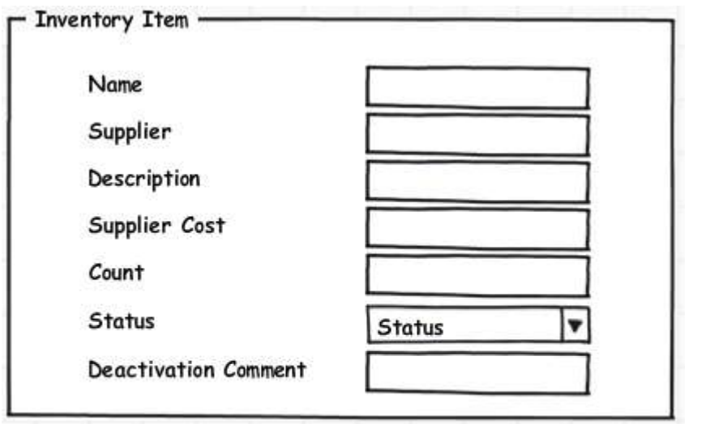

# 任务导向的接口设计（Task Based User Interface）

This chapter introduces the concept of a Task Based User Interface and compares it with a CRUD style user interface. It also shows the changes that occur within the Application Server when a more task oriented style is applied to it’s API.

本章介绍任务导向的接口设计的概念，也会将其与CRUD式的接口设计进行比较。本章还会展示当更多的任务导向的接口设计应用起来时，应用服务层的变化，

One of the largest problems seen in “A Stereotypical Architecture” was that the intent of the user was lost. Because the client interacted by posting data-centric DTOs back and forth with the Application Server, the domain was unable to have any verbs in it. The domain had become a glorified abstraction of the data model. There were no behaviors, the behaviors that existed, existed in the client, on pieces of paper, or in the heads of the users of the software.

“典型的架构”中最大的问题之一是用户的意图会丢失。因为客户端与应用服务器的交互方式是来回传递以数据为中心的DTO，因此这样的情况下领域内不包含任何动词。领域变成了一种数据模型的抽象美化，而没有任何行为。行为只存在于客户端，文档中或者是软件使用者的脑海里。

> 狠狠的讽刺呀。

Many examples of such applications can be cited. Users have “work flow” information documented for them. Go to screen xyz edit foo to bar, then go to this other screen and edit xyz to abc. For many types of systems this type of workflow is fine. These systems are also generally low value in terms of the business. In an area that is sufficiently complex and high enough ROI in order to use Domain Driven Design these types of workflows become unwieldy.

可以举例许多这样的案例。用户们有“工作流”文档。在屏幕上将foo编辑成bar，之后去另一个屏幕上将xyz编辑成abc。许多类型的系统中，这样的（分散的）的工作流已经足够了。这些系统普遍上是商业回报低的系统。而在具有足够复杂性且有足够投资回报率（ROI，Return on Investment）的系统中，即适用领域驱动设计的系统中，这样的工作流设计就会变得难以处理。

> 简单的系统不需要引入DDD，简单的设计足矣，而需要长期演进的复杂系统，适合DDD。

One reason that is commonly cited for wanting to build a system such as described is that “the business logic and work flows can be changed at any time to anything without need of a change to the software”. While this may be true it must be asked at what cost. What happens when someone misses a step in the process they have in their head or you have multiple users who do it differently as is commonly the case? How do you get any reasonable information out of a system in terms of reporting?

人们常提到的想要构建一个如上述所描述的系统的一个原因是：“业务逻辑和工作流程可以在任何时候被改变成任何内容，而无需对软件进行修改”。 尽管这可能是真的，但我们必须问问代价是什么，尤其是当某人忘掉流程中的某一步或者各种用户以各种方式使用软件的时候？你怎么保证系统都会得到合理的输出呢？

\
One way of dealing with this issue is to move away from the DTO up/down architecture that was illustrated in a “Stereotypical Architecture”. Figure 1 shows the client interaction side of a DTO up/down architecture.

一个应对该问题的方式是远离“典型的架构”这样的DTO上传和下载的架构，即Figure 1展示的那样。

> 这里再把图1捞出来：

<figure><figcaption><p>Figure 4 Interaction in a DTO Up/Down Architecture</p></figcaption></figure>

The basic explanation of the operation is that the UI will request a DTO, say for Customer 1234 from the Application Server. This DTO will be returned to the client and then shown on the screen. The user will interact with the DTO in some way (likely either directly or through a View Model). Eventually the client will click Save or some other trigger will occur and the client will take the DTO and send it back up to the Application Server. The Application Server will then internally map the data back to the domain model and save the changes returning a success or failure.

这样的架构的基本解释是UI需要DTO，比如从应用服务器获取顾客1234，DTO就会被返回给客户端，之后展示在屏幕上。用户和DTO以某种方式进行交互（比如直接或间接的操作视图模型（View Model））。最终客户端会点击保存按钮或者使用其他的触发方式，使得客户端将DTO对象返回给应用服务器。应用服务器随后将数据内部映射回域模型并保存更改，且返回成功或失败的结果。

\
As discussed the intention of the user is being lost because a DTO is being sent up that just represents the current state of the object after the client’s actions are completed. It is possible to bring forward the intention of the user; this will allow the Application Server to process behaviors as opposed to saving data. Figure shows an interaction capturing intent.

之前已经讨论过用户意图丢失的问题，其原因在于DTO对象只能代表客户端行为完成后的状态。我们可以提前获取用户意图，这使得应用服务器可以处理行为而非直接保存数据。图片展示了获取用户意图的交互过程。


<figure><figcaption><p>Figure 5 Behavioral Interface</p></figcaption></figure>

Capturing intent the client interaction is very similar to the DTO up/down methodology in terms of interactions. The client first quests a DTO from the Application Server for instance Customer 1234. The Application Server returns a DTO representing the customer that is then shown on the screen for the user to interact with usually either directly or through a View Model. The similarities however stop at this point.

就交互方式而言，获取用户意图与直接DTO上传下载的方法很相似。客户端首先从应用服务器为顾客1234获取一个DTO对象，应用服务器返回一个DTO供用户直接或间接的通过视图模型交互。之后的过程就不相同了。

\
Instead of simply sending the same DTO back up when the user is completed with their action the client needs to send a message to the Application Server telling it to **do something**. It could be to “Complete a Sale”, “Approve a Purchase Order”, “Submit a Loan Application”. Said simply the client needs to send a message to the Application Server to have it complete the task that the user would like to complete. By telling the Application Server what the user would like to do, it is possible to know the intention of the user.

当用户完成某些行为时，客户端需要向应用服务器发送消息让应用服务器**做某些事情**，而不是简单的发送相同的DTO回去，比如说：“完成交易”，“同意购买的订单”，“提交贷款申请”。说的简单点，客户端需要发送给应用服务器的消息包含用户想要完成的任务。通过告诉应用服务器用户想要干什么，才可能知道用户的意图。

## 命令 Commands

The method through which the Application Server will be told what to do is through the use of a Command. A command is a simple object with a name of an operation and the data required to perform that operation. Many think of Commands as being Serializable Method Calls. Listing 1 includes the code of a basic command.

告知应用服务器需要干什么是通过命令（Command）。命令是一个简单的拥有操作名和执行操作所需数据的对象。许多人认为命令是可序列化的方法调用。下面的List 1是一个基础命令的代码。


```java
public class DeactivateInventoryItemCommand {
 public readonly Guid InventoryItemId;
 public readononly string Comment;
 public DeactivateInventoryItemCommand (Guid id, string comment) {
 InventoryItemId = id;
 Comment = comment;
}
```


As a side note the example in Listing 1 includes the pattern name after the name of the Command. This is a decision that has many positives and negatives both linguistically and operationally. The choice over\
whether to use a pattern name in a class name is one that should not be taken lightly by a development\
team.

2025年05月06日14:01:16写到这了


One important aspect of Commands is that they are always in the imperative tense; that is they are\
telling the Application Server to do something. The linguistics with Commands are important. A situation\
could for with a disconnected client where something has already happened such as a sale and could\
want to send up a “SaleOccurred” Command object. When analyzing this, is the domain allowed to say\
no that this thing did not happen? Placing Commands in the imperative tense linguistically shows that\
the Application Server is allowed to reject the Command, if it were not allowed to, it would be an Event\
for more information on this see “Events”.


Occasionally there exist funny examples of language in English. A perfect example of this would be\
“Purchase” which can be used either as a verb in the imperative or as a noun describing the result of its\
usage in the imperative. When dealing with these situations, ensure that the concept being pushed\
forward represents the imperative of the verb and not the noun. As an example a purchase should be\
including what to purchase and expecting the domain to possibly fill in some information like when the\
item was purchased as opposed to sending up a purchase DTO that fully describes the purchase.


\
The simple Command in Listing 1 includes two data properties. It includes an Id which represents the\
InventoryItem it will apply to and it includes a comment as to why the item is being deactivated. The\
comment is quite typical of an attribute associated with a Command, it is a piece of data that is required\
in order to process the behavior. There should only exist on a Command data points that are required to\
process the given behavior. This contrasts greatly with the typical architecture where the entire data of\
the object is passed back to the Application Server.


Most importantly of the data is the Id of the associated inventory item. At least one Id must exist for all\
commands that are updating state in some way, as all commands are intended to be routed to an\
object. When issuing a Create Command it is not necessary though valuable to include an Id. Having the\
client originate Ids normally in the form of UUIDs is extremely valuable in distributed systems.

It is quite common for developers to learn about Commands and to very quickly start creating\
Commands using vocabulary familiar to them such as “ChangeAddress”, “CreateUser”, or “DeleteClass”.\
This should be avoided as a default. Instead a team should be focused on what the use case really is.


\
Is it “ChangeAddress”? Is there a difference between “Correcting an Address” and “Relocating the\
Customer”? It likely will be if the domain in question is for a telephone company that sends the yellow\
pages to a customer when they move to a new location.


\
Is it “CreateUser” or is it “RegisterUser”? “DeleteClass” or “DeregisterStudent”. This process in naming\
can lead to great amounts of domain insight. To begin defining Commands, the best place to begin is in\
defining use cases, as generally a Command and a use case align.


It is also important to note that sometimes the only use case that exists for a portion of data is to\
“create”, “edit”, “update”, “change”, or “delete” it. All applications carry information that is simply\
supporting information. It is important though to not fall into the trap of mistaking places where there\
are use cases associated with intent for these CRUD only places.


\
Commands as a concept are not difficult but are different for many developers. Many developers see\
the creation of the Commands as a lot of work. If the creation of Commands is a bottleneck in the\
workflow, many of the ideas being discussed are likely being applied in an incorrect location.

\


## User Interface


